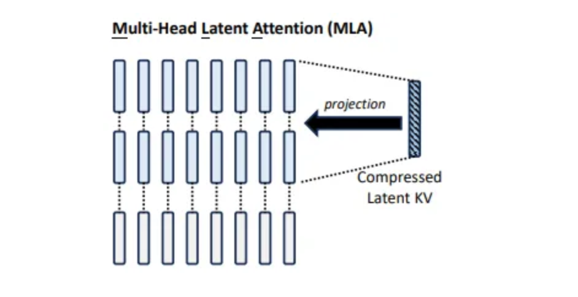

# MLA (Multi-Latent Attention)

A PyTorch implementation of Multi-Latent Attention from the [Deepseek V2 paper](https://arxiv.org/abs/2405.04434).



Please refer to the paper for more information.

## Requirements

- Python ≥ 3.12
- PyTorch (nightly build with CUDA 12.4)

## Installation

```bash
git clone https://github.com/Greg-Tarr/mla_pytorch.git
cd mla_pytorch
uv run mla_pytorch/mla.py
```

## Citation

```bibtex
@misc{deepseekai2024deepseekv2strongeconomicalefficient,
      title={DeepSeek-V2: A Strong, Economical, and Efficient Mixture-of-Experts Language Model},
      author={DeepSeek-AI and Aixin Liu and Bei Feng and Bin Wang and Bingxuan Wang and Bo Liu and Chenggang Zhao and Chengqi Dengr and Chong Ruan and Damai Dai and Daya Guo and Dejian Yang and Deli Chen and Dongjie Ji and Erhang Li and Fangyun Lin and Fuli Luo and Guangbo Hao and Guanting Chen and Guowei Li and H. Zhang and Hanwei Xu and Hao Yang and Haowei Zhang and Honghui Ding and Huajian Xin and Huazuo Gao and Hui Li and Hui Qu and J. L. Cai and Jian Liang and Jianzhong Guo and Jiaqi Ni and Jiashi Li and Jin Chen and Jingyang Yuan and Junjie Qiu and Junxiao Song and Kai Dong and Kaige Gao and Kang Guan and Lean Wang and Lecong Zhang and Lei Xu and Leyi Xia and Liang Zhao and Liyue Zhang and Meng Li and Miaojun Wang and Mingchuan Zhang and Minghua Zhang and Minghui Tang and Mingming Li and Ning Tian and Panpan Huang and Peiyi Wang and Peng Zhang and Qihao Zhu and Qinyu Chen and Qiushi Du and R. J. Chen and R. L. Jin and Ruiqi Ge and Ruizhe Pan and Runxin Xu and Ruyi Chen and S. S. Li and Shanghao Lu and Shangyan Zhou and Shanhuang Chen and Shaoqing Wu and Shengfeng Ye and Shirong Ma and Shiyu Wang and Shuang Zhou and Shuiping Yu and Shunfeng Zhou and Size Zheng and T. Wang and Tian Pei and Tian Yuan and Tianyu Sun and W. L. Xiao and Wangding Zeng and Wei An and Wen Liu and Wenfeng Liang and Wenjun Gao and Wentao Zhang and X. Q. Li and Xiangyue Jin and Xianzu Wang and Xiao Bi and Xiaodong Liu and Xiaohan Wang and Xiaojin Shen and Xiaokang Chen and Xiaosha Chen and Xiaotao Nie and Xiaowen Sun and Xiaoxiang Wang and Xin Liu and Xin Xie and Xingkai Yu and Xinnan Song and Xinyi Zhou and Xinyu Yang and Xuan Lu and Xuecheng Su and Y. Wu and Y. K. Li and Y. X. Wei and Y. X. Zhu and Yanhong Xu and Yanping Huang and Yao Li and Yao Zhao and Yaofeng Sun and Yaohui Li and Yaohui Wang and Yi Zheng and Yichao Zhang and Yiliang Xiong and Yilong Zhao and Ying He and Ying Tang and Yishi Piao and Yixin Dong and Yixuan Tan and Yiyuan Liu and Yongji Wang and Yongqiang Guo and Yuchen Zhu and Yuduan Wang and Yuheng Zou and Yukun Zha and Yunxian Ma and Yuting Yan and Yuxiang You and Yuxuan Liu and Z. Z. Ren and Zehui Ren and Zhangli Sha and Zhe Fu and Zhen Huang and Zhen Zhang and Zhenda Xie and Zhewen Hao and Zhihong Shao and Zhiniu Wen and Zhipeng Xu and Zhongyu Zhang and Zhuoshu Li and Zihan Wang and Zihui Gu and Zilin Li and Ziwei Xie},
      year={2024},
      eprint={2405.04434},
      archivePrefix={arXiv},
      primaryClass={cs.CL},
      url={https://arxiv.org/abs/2405.04434},
}
```
